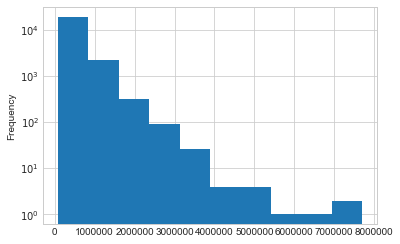
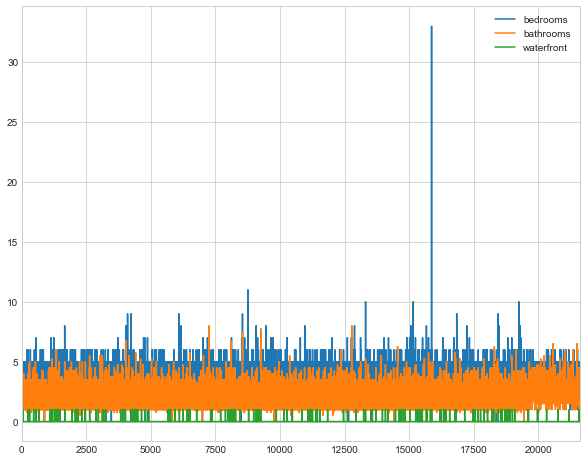
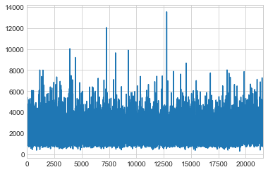
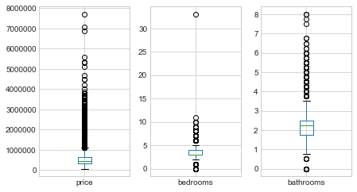

# Very basic housing project:

## Goal:
 - Predict the KC county house prices

### Importing the  necessary libraries


```python
import numpy as np
import pandas as pd
import matplotlib.pyplot as plt
%matplotlib inline

import seaborn as sns
sns.set_style('whitegrid')
import warnings
warnings.filterwarnings('ignore')


from scipy import stats
from sklearn import linear_model
from sklearn import neighbors
from sklearn.metrics import mean_squared_error
from sklearn import preprocessing
from sklearn.model_selection import train_test_split

from math import log
```

### Load data set


```python
data=pd.read_csv('kc_house_data.csv',parse_dates=['date'])
```


```python
data.describe()
```


<div>
<style>
    .dataframe thead tr:only-child th {
        text-align: right;
    }

    .dataframe thead th {
        text-align: left;
    }

    .dataframe tbody tr th {
        vertical-align: top;
    }
</style>
<table border="1" class="dataframe">
  <thead>
    <tr style="text-align: right;">
      <th></th>
      <th>id</th>
      <th>price</th>
      <th>bedrooms</th>
      <th>bathrooms</th>
      <th>sqft_living</th>
      <th>sqft_lot</th>
      <th>floors</th>
      <th>waterfront</th>
      <th>view</th>
      <th>condition</th>
      <th>grade</th>
      <th>sqft_above</th>
      <th>sqft_basement</th>
      <th>yr_built</th>
      <th>yr_renovated</th>
      <th>zipcode</th>
      <th>lat</th>
      <th>long</th>
      <th>sqft_living15</th>
      <th>sqft_lot15</th>
    </tr>
  </thead>
  <tbody>
    <tr>
      <th>count</th>
      <td>2.161300e+04</td>
      <td>2.161300e+04</td>
      <td>21613.000000</td>
      <td>21613.000000</td>
      <td>21613.000000</td>
      <td>2.161300e+04</td>
      <td>21613.000000</td>
      <td>21613.000000</td>
      <td>21613.000000</td>
      <td>21613.000000</td>
      <td>21613.000000</td>
      <td>21613.000000</td>
      <td>21613.000000</td>
      <td>21613.000000</td>
      <td>21613.000000</td>
      <td>21613.000000</td>
      <td>21613.000000</td>
      <td>21613.000000</td>
      <td>21613.000000</td>
      <td>21613.000000</td>
    </tr>
    <tr>
      <th>mean</th>
      <td>4.580302e+09</td>
      <td>5.400881e+05</td>
      <td>3.370842</td>
      <td>2.114757</td>
      <td>2079.899736</td>
      <td>1.510697e+04</td>
      <td>1.494309</td>
      <td>0.007542</td>
      <td>0.234303</td>
      <td>3.409430</td>
      <td>7.656873</td>
      <td>1788.390691</td>
      <td>291.509045</td>
      <td>1971.005136</td>
      <td>84.402258</td>
      <td>98077.939805</td>
      <td>47.560053</td>
      <td>-122.213896</td>
      <td>1986.552492</td>
      <td>12768.455652</td>
    </tr>
    <tr>
      <th>std</th>
      <td>2.876566e+09</td>
      <td>3.671272e+05</td>
      <td>0.930062</td>
      <td>0.770163</td>
      <td>918.440897</td>
      <td>4.142051e+04</td>
      <td>0.539989</td>
      <td>0.086517</td>
      <td>0.766318</td>
      <td>0.650743</td>
      <td>1.175459</td>
      <td>828.090978</td>
      <td>442.575043</td>
      <td>29.373411</td>
      <td>401.679240</td>
      <td>53.505026</td>
      <td>0.138564</td>
      <td>0.140828</td>
      <td>685.391304</td>
      <td>27304.179631</td>
    </tr>
    <tr>
      <th>min</th>
      <td>1.000102e+06</td>
      <td>7.500000e+04</td>
      <td>0.000000</td>
      <td>0.000000</td>
      <td>290.000000</td>
      <td>5.200000e+02</td>
      <td>1.000000</td>
      <td>0.000000</td>
      <td>0.000000</td>
      <td>1.000000</td>
      <td>1.000000</td>
      <td>290.000000</td>
      <td>0.000000</td>
      <td>1900.000000</td>
      <td>0.000000</td>
      <td>98001.000000</td>
      <td>47.155900</td>
      <td>-122.519000</td>
      <td>399.000000</td>
      <td>651.000000</td>
    </tr>
    <tr>
      <th>25%</th>
      <td>2.123049e+09</td>
      <td>3.219500e+05</td>
      <td>3.000000</td>
      <td>1.750000</td>
      <td>1427.000000</td>
      <td>5.040000e+03</td>
      <td>1.000000</td>
      <td>0.000000</td>
      <td>0.000000</td>
      <td>3.000000</td>
      <td>7.000000</td>
      <td>1190.000000</td>
      <td>0.000000</td>
      <td>1951.000000</td>
      <td>0.000000</td>
      <td>98033.000000</td>
      <td>47.471000</td>
      <td>-122.328000</td>
      <td>1490.000000</td>
      <td>5100.000000</td>
    </tr>
    <tr>
      <th>50%</th>
      <td>3.904930e+09</td>
      <td>4.500000e+05</td>
      <td>3.000000</td>
      <td>2.250000</td>
      <td>1910.000000</td>
      <td>7.618000e+03</td>
      <td>1.500000</td>
      <td>0.000000</td>
      <td>0.000000</td>
      <td>3.000000</td>
      <td>7.000000</td>
      <td>1560.000000</td>
      <td>0.000000</td>
      <td>1975.000000</td>
      <td>0.000000</td>
      <td>98065.000000</td>
      <td>47.571800</td>
      <td>-122.230000</td>
      <td>1840.000000</td>
      <td>7620.000000</td>
    </tr>
    <tr>
      <th>75%</th>
      <td>7.308900e+09</td>
      <td>6.450000e+05</td>
      <td>4.000000</td>
      <td>2.500000</td>
      <td>2550.000000</td>
      <td>1.068800e+04</td>
      <td>2.000000</td>
      <td>0.000000</td>
      <td>0.000000</td>
      <td>4.000000</td>
      <td>8.000000</td>
      <td>2210.000000</td>
      <td>560.000000</td>
      <td>1997.000000</td>
      <td>0.000000</td>
      <td>98118.000000</td>
      <td>47.678000</td>
      <td>-122.125000</td>
      <td>2360.000000</td>
      <td>10083.000000</td>
    </tr>
    <tr>
      <th>max</th>
      <td>9.900000e+09</td>
      <td>7.700000e+06</td>
      <td>33.000000</td>
      <td>8.000000</td>
      <td>13540.000000</td>
      <td>1.651359e+06</td>
      <td>3.500000</td>
      <td>1.000000</td>
      <td>4.000000</td>
      <td>5.000000</td>
      <td>13.000000</td>
      <td>9410.000000</td>
      <td>4820.000000</td>
      <td>2015.000000</td>
      <td>2015.000000</td>
      <td>98199.000000</td>
      <td>47.777600</td>
      <td>-121.315000</td>
      <td>6210.000000</td>
      <td>871200.000000</td>
    </tr>
  </tbody>
</table>
</div>


Looking for outliers:


```python
data.price.plot(kind='hist',log=True)
```


    <matplotlib.axes._subplots.AxesSubplot at 0x7fb5db910310>





```python
data[data['price']>4e6] # 11 houses greated than 4M
```


<div>
<style>
    .dataframe thead tr:only-child th {
        text-align: right;
    }

    .dataframe thead th {
        text-align: left;
    }

    .dataframe tbody tr th {
        vertical-align: top;
    }
</style>
<table border="1" class="dataframe">
  <thead>
    <tr style="text-align: right;">
      <th></th>
      <th>id</th>
      <th>date</th>
      <th>price</th>
      <th>bedrooms</th>
      <th>bathrooms</th>
      <th>sqft_living</th>
      <th>sqft_lot</th>
      <th>floors</th>
      <th>waterfront</th>
      <th>view</th>
      <th>...</th>
      <th>grade</th>
      <th>sqft_above</th>
      <th>sqft_basement</th>
      <th>yr_built</th>
      <th>yr_renovated</th>
      <th>zipcode</th>
      <th>lat</th>
      <th>long</th>
      <th>sqft_living15</th>
      <th>sqft_lot15</th>
    </tr>
  </thead>
  <tbody>
    <tr>
      <th>1164</th>
      <td>1247600105</td>
      <td>2014-10-20</td>
      <td>5110800.0</td>
      <td>5</td>
      <td>5.25</td>
      <td>8010</td>
      <td>45517</td>
      <td>2.0</td>
      <td>1</td>
      <td>4</td>
      <td>...</td>
      <td>12</td>
      <td>5990</td>
      <td>2020</td>
      <td>1999</td>
      <td>0</td>
      <td>98033</td>
      <td>47.6767</td>
      <td>-122.211</td>
      <td>3430</td>
      <td>26788</td>
    </tr>
    <tr>
      <th>1315</th>
      <td>7558700030</td>
      <td>2015-04-13</td>
      <td>5300000.0</td>
      <td>6</td>
      <td>6.00</td>
      <td>7390</td>
      <td>24829</td>
      <td>2.0</td>
      <td>1</td>
      <td>4</td>
      <td>...</td>
      <td>12</td>
      <td>5000</td>
      <td>2390</td>
      <td>1991</td>
      <td>0</td>
      <td>98040</td>
      <td>47.5631</td>
      <td>-122.210</td>
      <td>4320</td>
      <td>24619</td>
    </tr>
    <tr>
      <th>1448</th>
      <td>8907500070</td>
      <td>2015-04-13</td>
      <td>5350000.0</td>
      <td>5</td>
      <td>5.00</td>
      <td>8000</td>
      <td>23985</td>
      <td>2.0</td>
      <td>0</td>
      <td>4</td>
      <td>...</td>
      <td>12</td>
      <td>6720</td>
      <td>1280</td>
      <td>2009</td>
      <td>0</td>
      <td>98004</td>
      <td>47.6232</td>
      <td>-122.220</td>
      <td>4600</td>
      <td>21750</td>
    </tr>
    <tr>
      <th>2626</th>
      <td>7738500731</td>
      <td>2014-08-15</td>
      <td>4500000.0</td>
      <td>5</td>
      <td>5.50</td>
      <td>6640</td>
      <td>40014</td>
      <td>2.0</td>
      <td>1</td>
      <td>4</td>
      <td>...</td>
      <td>12</td>
      <td>6350</td>
      <td>290</td>
      <td>2004</td>
      <td>0</td>
      <td>98155</td>
      <td>47.7493</td>
      <td>-122.280</td>
      <td>3030</td>
      <td>23408</td>
    </tr>
    <tr>
      <th>3914</th>
      <td>9808700762</td>
      <td>2014-06-11</td>
      <td>7062500.0</td>
      <td>5</td>
      <td>4.50</td>
      <td>10040</td>
      <td>37325</td>
      <td>2.0</td>
      <td>1</td>
      <td>2</td>
      <td>...</td>
      <td>11</td>
      <td>7680</td>
      <td>2360</td>
      <td>1940</td>
      <td>2001</td>
      <td>98004</td>
      <td>47.6500</td>
      <td>-122.214</td>
      <td>3930</td>
      <td>25449</td>
    </tr>
    <tr>
      <th>4411</th>
      <td>2470100110</td>
      <td>2014-08-04</td>
      <td>5570000.0</td>
      <td>5</td>
      <td>5.75</td>
      <td>9200</td>
      <td>35069</td>
      <td>2.0</td>
      <td>0</td>
      <td>0</td>
      <td>...</td>
      <td>13</td>
      <td>6200</td>
      <td>3000</td>
      <td>2001</td>
      <td>0</td>
      <td>98039</td>
      <td>47.6289</td>
      <td>-122.233</td>
      <td>3560</td>
      <td>24345</td>
    </tr>
    <tr>
      <th>7252</th>
      <td>6762700020</td>
      <td>2014-10-13</td>
      <td>7700000.0</td>
      <td>6</td>
      <td>8.00</td>
      <td>12050</td>
      <td>27600</td>
      <td>2.5</td>
      <td>0</td>
      <td>3</td>
      <td>...</td>
      <td>13</td>
      <td>8570</td>
      <td>3480</td>
      <td>1910</td>
      <td>1987</td>
      <td>98102</td>
      <td>47.6298</td>
      <td>-122.323</td>
      <td>3940</td>
      <td>8800</td>
    </tr>
    <tr>
      <th>8092</th>
      <td>1924059029</td>
      <td>2014-06-17</td>
      <td>4668000.0</td>
      <td>5</td>
      <td>6.75</td>
      <td>9640</td>
      <td>13068</td>
      <td>1.0</td>
      <td>1</td>
      <td>4</td>
      <td>...</td>
      <td>12</td>
      <td>4820</td>
      <td>4820</td>
      <td>1983</td>
      <td>2009</td>
      <td>98040</td>
      <td>47.5570</td>
      <td>-122.210</td>
      <td>3270</td>
      <td>10454</td>
    </tr>
    <tr>
      <th>8638</th>
      <td>3835500195</td>
      <td>2014-06-18</td>
      <td>4489000.0</td>
      <td>4</td>
      <td>3.00</td>
      <td>6430</td>
      <td>27517</td>
      <td>2.0</td>
      <td>0</td>
      <td>0</td>
      <td>...</td>
      <td>12</td>
      <td>6430</td>
      <td>0</td>
      <td>2001</td>
      <td>0</td>
      <td>98004</td>
      <td>47.6208</td>
      <td>-122.219</td>
      <td>3720</td>
      <td>14592</td>
    </tr>
    <tr>
      <th>9254</th>
      <td>9208900037</td>
      <td>2014-09-19</td>
      <td>6885000.0</td>
      <td>6</td>
      <td>7.75</td>
      <td>9890</td>
      <td>31374</td>
      <td>2.0</td>
      <td>0</td>
      <td>4</td>
      <td>...</td>
      <td>13</td>
      <td>8860</td>
      <td>1030</td>
      <td>2001</td>
      <td>0</td>
      <td>98039</td>
      <td>47.6305</td>
      <td>-122.240</td>
      <td>4540</td>
      <td>42730</td>
    </tr>
    <tr>
      <th>12370</th>
      <td>6065300370</td>
      <td>2015-05-06</td>
      <td>4208000.0</td>
      <td>5</td>
      <td>6.00</td>
      <td>7440</td>
      <td>21540</td>
      <td>2.0</td>
      <td>0</td>
      <td>0</td>
      <td>...</td>
      <td>12</td>
      <td>5550</td>
      <td>1890</td>
      <td>2003</td>
      <td>0</td>
      <td>98006</td>
      <td>47.5692</td>
      <td>-122.189</td>
      <td>4740</td>
      <td>19329</td>
    </tr>
  </tbody>
</table>
<p>11 rows × 21 columns</p>
</div>


```python
plt.figure(figsize=(10,8))
data.bedrooms.plot(),data.bathrooms.plot(),data.waterfront.plot()
plt.legend()
```


    <matplotlib.legend.Legend at 0x7fb5db4f7110>





```python
data.sqft_living.plot()
```


    <matplotlib.axes._subplots.AxesSubplot at 0x7fb5db7568d0>





# BOX PLOT


```python
fig=plt.figure(figsize=(6,10))

ax1=plt.subplot(331)
ax2=plt.subplot(332)
ax3=plt.subplot(333)
#ax4=plt.subplot(334)
#ax5=plt.subplot(335)
#ax6=plt.subplot(336)
#ax7=plt.subplot(337)


data.boxplot(column='price',ax=ax1)
data.boxplot(column='bedrooms',ax=ax2)
data.boxplot(column='bathrooms',ax=ax3)


plt.suptitle('')
plt.tight_layout()
```





```python
data[data['bedrooms']>10]
```


<div>
<style>
    .dataframe thead tr:only-child th {
        text-align: right;
    }

    .dataframe thead th {
        text-align: left;
    }

    .dataframe tbody tr th {
        vertical-align: top;
    }
</style>
<table border="1" class="dataframe">
  <thead>
    <tr style="text-align: right;">
      <th></th>
      <th>id</th>
      <th>date</th>
      <th>price</th>
      <th>bedrooms</th>
      <th>bathrooms</th>
      <th>sqft_living</th>
      <th>sqft_lot</th>
      <th>floors</th>
      <th>waterfront</th>
      <th>view</th>
      <th>...</th>
      <th>grade</th>
      <th>sqft_above</th>
      <th>sqft_basement</th>
      <th>yr_built</th>
      <th>yr_renovated</th>
      <th>zipcode</th>
      <th>lat</th>
      <th>long</th>
      <th>sqft_living15</th>
      <th>sqft_lot15</th>
    </tr>
  </thead>
  <tbody>
    <tr>
      <th>8757</th>
      <td>1773100755</td>
      <td>2014-08-21</td>
      <td>520000.0</td>
      <td>11</td>
      <td>3.00</td>
      <td>3000</td>
      <td>4960</td>
      <td>2.0</td>
      <td>0</td>
      <td>0</td>
      <td>...</td>
      <td>7</td>
      <td>2400</td>
      <td>600</td>
      <td>1918</td>
      <td>1999</td>
      <td>98106</td>
      <td>47.5560</td>
      <td>-122.363</td>
      <td>1420</td>
      <td>4960</td>
    </tr>
    <tr>
      <th>15870</th>
      <td>2402100895</td>
      <td>2014-06-25</td>
      <td>640000.0</td>
      <td>33</td>
      <td>1.75</td>
      <td>1620</td>
      <td>6000</td>
      <td>1.0</td>
      <td>0</td>
      <td>0</td>
      <td>...</td>
      <td>7</td>
      <td>1040</td>
      <td>580</td>
      <td>1947</td>
      <td>0</td>
      <td>98103</td>
      <td>47.6878</td>
      <td>-122.331</td>
      <td>1330</td>
      <td>4700</td>
    </tr>
  </tbody>
</table>
<p>2 rows × 21 columns</p>
</div>


# Removing Outliers


```python
outliers=data.quantile(0.90)
x=data[(data['price']<outliers['price'])]
x=x[(x['bedrooms']< outliers['bedrooms'])]
x=x[(x['bathrooms']< outliers['bathrooms'])]
x=x[(x['sqft_living']< outliers['sqft_living'])]
x.shape
```


    (11712, 21)


```python
data.shape
```


    (21613, 21)


# Creating Dummies


```python
x_zipcode=pd.get_dummies(x['zipcode'],drop_first=True)
```


```python
x=pd.concat([x,x_zipcode],axis=1)
```

# Feature Engineering


```python
x['built_ago']=2017-x['yr_built']
x['have_basement']=np.where(x['sqft_living']>0,1,0)
x['renovated']=np.where(x['yr_renovated']>0,1,0)
x['weighted_bath']=x['bathrooms'] **2
x['weighted_livingspace']=x['sqft_living']**2
x['diff_living']=x['sqft_living']-x['sqft_living15']
x['bed_bath_ratio']=(x['bedrooms']+1)/(x['bathrooms']+1)
```


```python
y=x.price
x=x.drop(['id','date','zipcode','lat','long','price','yr_built','sqft_basement','bathrooms'],axis=1) # all of them id date zipcode lat long price yr_renovated yr_built sqft_basement bathrooms grade
```

# Train Test Split


```python
# Linear Regression
x_train,x_test,y_train,y_test=train_test_split(x,y,train_size=0.8,random_state=42)
x_train.shape,y_train.shape,x_test.shape,y_test.shape
```


    ((9369, 88), (9369,), (2343, 88), (2343,))


### Use Linear Regression


```python
reg=linear_model.LinearRegression()
regmodel=reg.fit(x_train,y_train)
y_predtest=reg.predict(x_test)
```


```python
RMS=mean_squared_error(y_test,y_predtest) ** 0.5
RMS
```


    71972.313409169568


####  Use Lasso Model:


```python
from sklearn.linear_model import Lasso
ls=Lasso()
l=ls.fit(x_train,y_train)
y_ls_predtest=ls.predict(x_test)
ls_rmse=mean_squared_error(y_test,y_ls_predtest) ** 0.5
ls_rmse
```


    71872.274572752882


